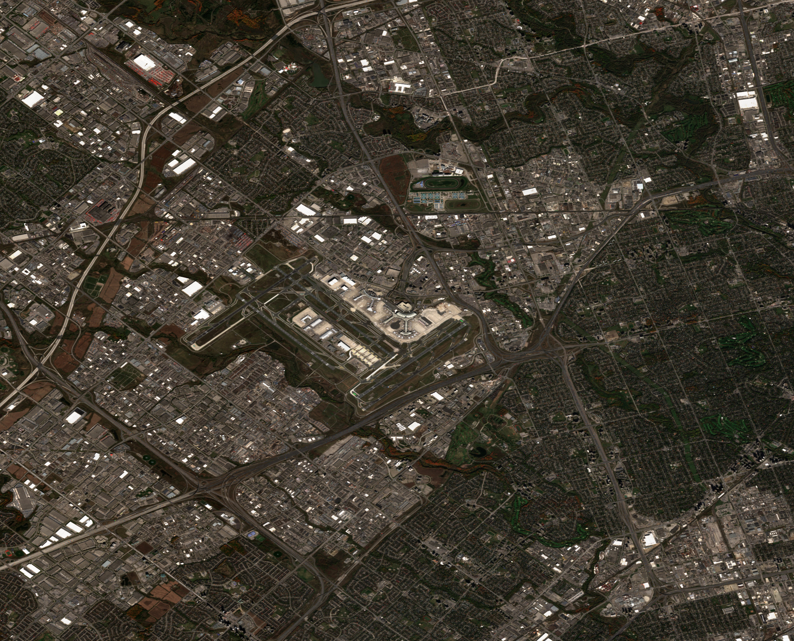

# Exodus Orbital Python SDK for the satellite API

## Second challenge
Can you write the code that identifies the airplanes in the picture?


## results 


[data.cvs](./data_filtered.cvs)


# First model object detection with fast-rccn 
## Please refer the ```./challenge2-detectron2.ipynb``` file.
file [challenge2 detectron](./challenge2-detectron2.ipynb)

Used model: [model fast-rcnn](./model_0024999.pth)
Framework Detectron V2 from [Facebook Research](https://github.com/facebookresearch/detectron2)

The results are relatively good given that we do not have any specific set of data to train the model.


A large threshold of  `0.7` was applied since we will use another model to filter false positives.

## Second model classification: classic dense CNN.
## Please refer the ```./challenge2-CCN.ipynb``` file.

file [challenge 2 CCN](./challenge-2-CNN.ipynb)

Using first model as a ROI provider we refine results removing false positives.
Model file [model](./model.keras) Trained on goolgle colab free tier GPU.
This model is very effective since it was trained with data dimilar to the provided image.

final result in `result.tiff` and `./data_filtered.csv` files.

## Used tools:
- ML: 
        - Detectron v2 from [Facebook Research](https://github.com/facebookresearch/detectron2) rareplanes dataset and initial model.
        - CCN model with Tensorflow and Keras.
- SDK:
    - Python
    - Jupyter note book
    - Google Colab T4 GPU, free tier

- OS:
    - Ubuntu 
    - Windows 11 with WSL2

## What's next
- Futher train models on more specific dataset
- Merge both model [resulting in a YOLO like final model]
- Improve the docs 


Please do the following for presenting solution of the second challenge:
- code repo (can be private)
- short writeup / presentation how you did it, including the following:
  - general outline of solution
  - libraries and tools used
  - what could have been done, if more time and resources were available.
  - computation resources used for training/inference, if any ML tools used.

You can used DoraHack plaform for submission (as BUIDLs )